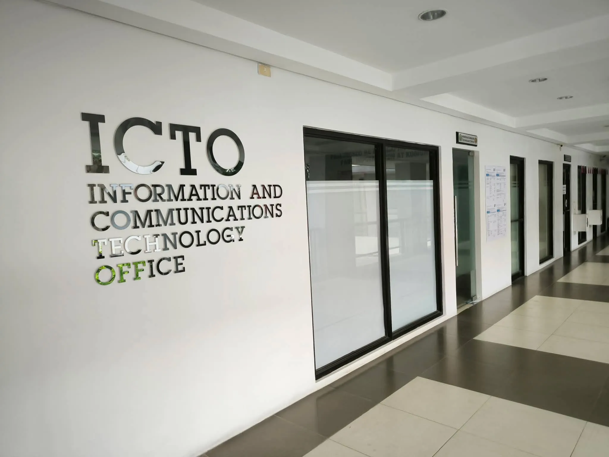
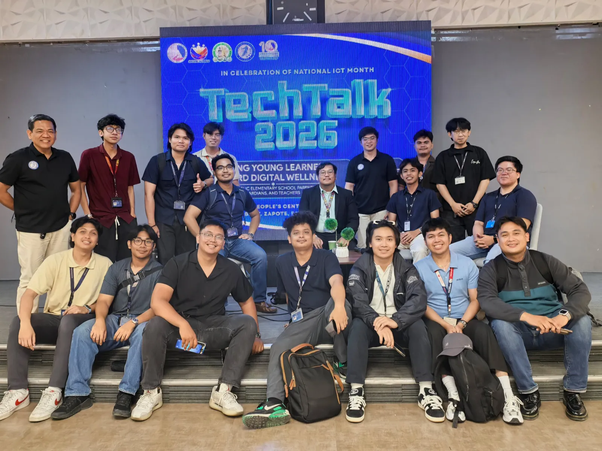
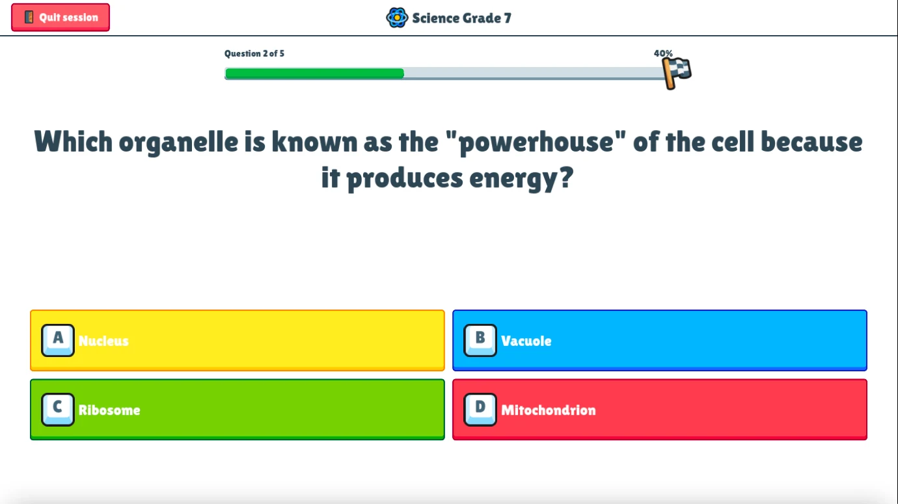
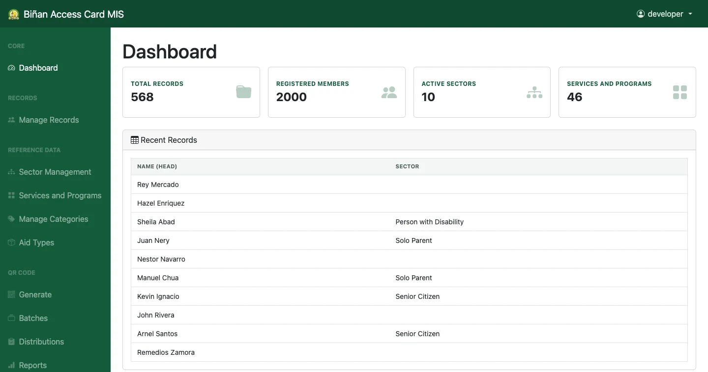
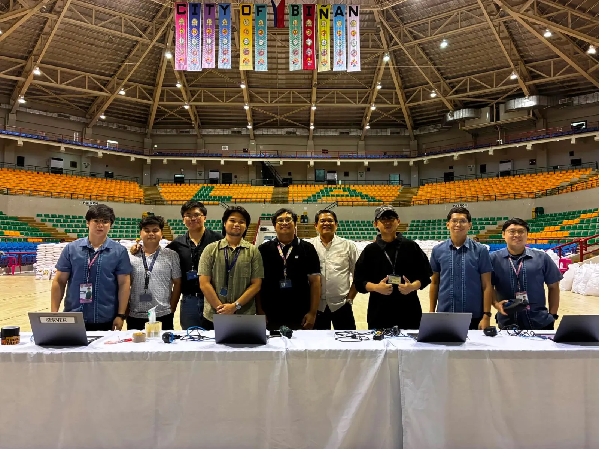
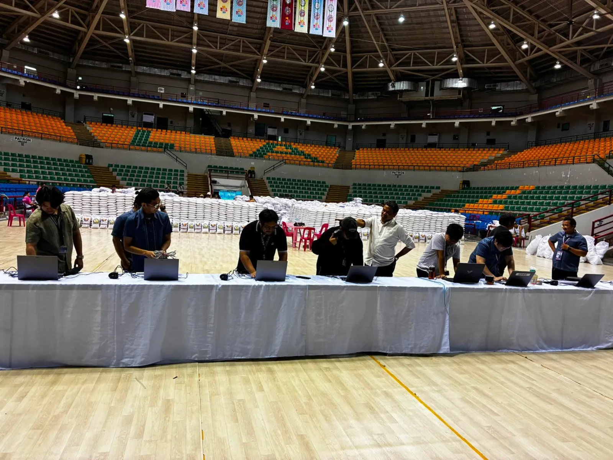

## Introduction

### My practicum journey.

This documents my IT Practicum (IT199F) at the Information and Communications Technology Office (ICTO) of the City Government of Biñan, Laguna, rendered from April 29 to July 25, 2026 in partial fulfillment of the requirements for the degree of Bachelor of Science in Information Technology at Mapúa Malayan Colleges Laguna. The practicum required a minimum of 486 hours, which I completed on-site on an 8:00 AM to 5:00 PM shift, Monday to Friday.

## Company Background

### The office behind the city's digital services.

Biñan is a city in the province of Laguna, within the CALABARZON region of the Philippines, and functions as a key trading hub south of Metro Manila. The ICTO operates under the City Government of Biñan as the department responsible for the city's information systems, IT infrastructure, and technology-driven public service initiatives. It is headed by the City ICT Officer, Sir Ramon Almazan.

 

## Nature of Tasks

### From educational games to a government system.

I worked under the ICTO's Software Development and Creative Support team, and the assignment was flexible. I moved between game development in Godot for the office's educational initiatives and web development in CodeIgniter 4 for its government systems. The first half of the practicum centered on Eskwelabs, an application I proposed, designed, and built on my own; in the second half, I was absorbed into the Biñan Access Card MIS as its lead developer.

The 486 required hours were allotted across four training phases:

| Training phase | Hours |
| --- | --- |
| Software Development | 342 |
| Company Orientation | 48 |
| Technical Documentation | 48 |
| Other IT-related activities | 48 |
| **Total** | **486** |

## Eskwelabs

### A tool that lets teachers build their own learning games.

Eskwelabs (formerly Eureka) is an offline Godot 4.3 application that lets teachers create their own gamified learning activities from templates. Before it, every gamified module the office produced required the creative team for illustrations and the development team to build the content into scenes, so each new activity was effectively a two-team project. Eskwelabs replaces that pipeline with a form and turns activity creation into a short, repeatable loop:

1. The teacher picks a template.
2. They enter the activity content.
3. The application generates a playable module on the same device.
4. Students play it and receive a score, all stored locally with no internet needed.

I proposed the concept, pitched it to the City ICT Officer, and built it as a solo project. Its interface went through three design iterations in Figma. The first read like a website, which was wrong for a tool meant to produce games, so it was discarded before it cost any development time; the second rebuilt the interface around game-style navigation and became the basis of the implemented screens. The current build is a functional prototype covering the complete input-process-output loop, from activity creation through play and scoring.

 

## Biñan Access Card MIS

### Access cards that speed up aid distribution.

The Biñan Access Card MIS is a CodeIgniter 4 and MySQL web application built for the City Social Welfare and Development Office (CSWD). It digitalizes the CSWD Family Profiling Form, the office's most complex manual form, into an encoder data entry workflow, and manages beneficiary records, sectors, services and programs, and categories. Its core feature, which I led and integrated, is QR code tracking and validation: each beneficiary card carries a unique QR code, and scanner stations log every receiving transaction against it. The system runs on five roles: a Developer or Superadmin with full access for building and configuring the system, an Admin who handles day-to-day management of records, sectors, services and programs, and categories, an Encoder who performs data entry through the digitalized Family Profiling Form, a Scanner who operates the QR verification screen during distribution, and a Viewer with read-only access for record lookups and monitoring.

The plan met reality a week before rollout. The encoders had not finished importing the family records, so validating each scan against them was not possible in time. Rather than delay a distribution thousands of beneficiaries were waiting on, we shipped the QR module in a logging mode that records who received, and scheduled the reconciliation against the records after the import. The system runs fully local through XAMPP with vendored Composer dependencies, so it operates without an internet connection. It went live in a three-day rice subsidy distribution pilot, logging more than 9,000 QR codes across 16 scanner stations on its first day.

  

## Synthesis

### What I gained from the experience.

The practicum's course outcomes asked me to identify and design a business process solution, apply systems analysis, software engineering, database, and programming concepts to a real organization, and acquire new knowledge within it. Eskwelabs was the business process solution: the problem was not stated to me but found during orientation, in the gap between how many gamified modules the office wanted and how much design and development effort each one cost. The Access Card MIS exercised the systems side, from digitalizing a dense manual form into database-backed records to designing transaction logging that stays reconcilable with the family records even when those records arrive later. In both projects, the adjustment, not the original plan, is what was delivered. I completed the 486-hour requirement on July 25, 2026, and can measure the practicum against a working Eskwelabs prototype and a government system that logged more than 9,000 beneficiary transactions on its first live day.
