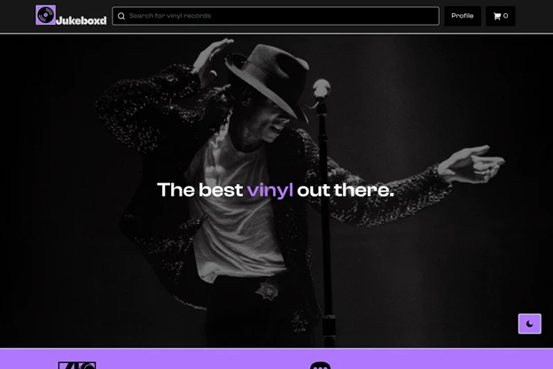
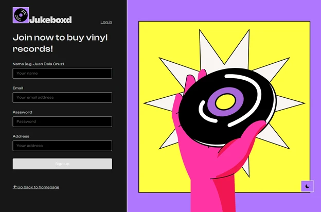
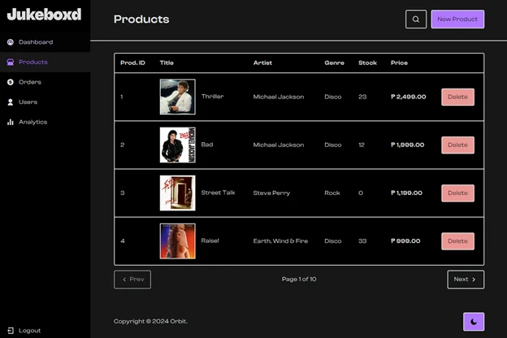
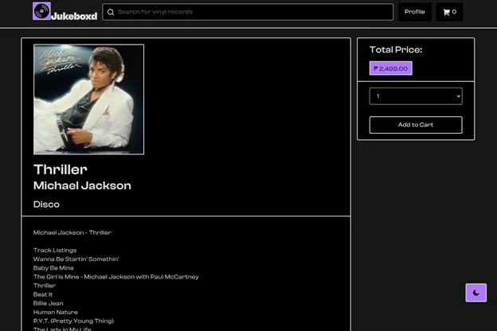
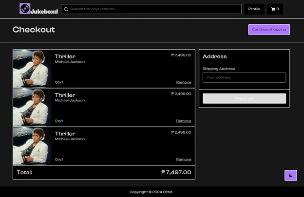
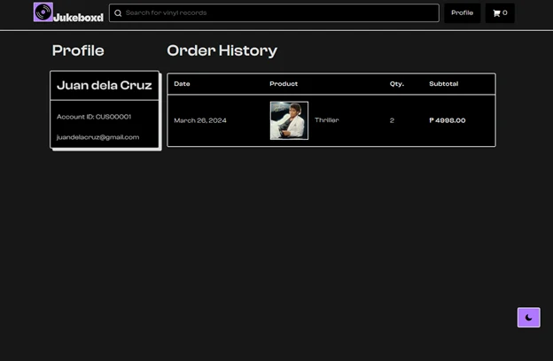
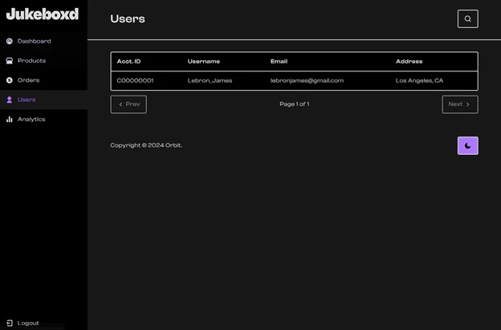

## The Brief

### A record store I designed but could never run.

Jukeboxd is a vinyl record e-commerce site built for our second machine problem in IT114L: a storefront where customers browse records, read tracklists, cart, and check out, and an admin dashboard for managing products, orders, and users. The course dictated the stack, C# ASP.NET Web Forms over a SQL Server database. The name is exactly the pun it looks like: Letterboxd, but for records.

## Context

### Same five people, inverted problem.

Five weeks after Orbit shipped, the same team of five got the opposite assignment. Orbit was pure frontend over a backend we were forbidden to touch; Jukeboxd was full stack in a framework none of us had opened before, `.aspx` pages, server controls, and a `mystore.mdf` database holding four tables: accounts, records, cart, and order logs. I pitched the concept and owned the design again, this time a store instead of a social network.



## The Constraint

### Web Forms does not run on a Mac.

My laptop runs macOS. ASP.NET Web Forms lives on the .NET Framework, which is Windows-only, and Visual Studio for Mac, already scheduled for retirement, never supported it anyway. I could not open the solution, could not start IIS Express, could not once run the application I was designing. The repository's 89 commits contain zero from my account, and every one of my contributions passed through a teammate's Windows machine to get in.

## Solution

### Design in the browser, ship through teammates.

The workaround was to deliver design in the one runtime a Mac does have. I built pages as plain HTML, CSS, and JavaScript prototypes that ran in a browser tab, and teammates converted them into `.aspx` pages wired to the database. That made communication the actual tool of the project: every page came with the working prototype, and the conversation was about what the converted version had to match.

The direction was neubrutalism filtered through Gumroad's storefront: a warm cream `#f9f5f1` background, 2px solid black borders on everything, Clash Display for all type, yellow `#ffff42` stickers, and purple `#af78fe` as the accent. The signature interaction is Gumroad's button hover, where the element lifts up and left and leaves a hard, unblurred shadow behind:

```css
.btn:not(:disabled):hover {
    box-shadow: 0.25rem 0.25rem 0 var(--filled);
    transform: translate(-0.25rem, -0.25rem);
}
```

The tokens live as CSS custom properties in one `general.css`, the same play that kept five people consistent on Orbit, and dark mode is a `.dark-mode` class that reassigns `--background` and `--filled` while the purple accent holds in both themes. A toggle persists the choice to localStorage and swaps the logo SVG to its dark variant.



## A Deeper Look

### What survives a conversion, and what does not.

The CSS survived the trip intact. Class names carried from prototype to `.aspx` unchanged, so the borders, the hover shadows, and the theme variables all rendered exactly as designed. The JavaScript mostly did not: Web Forms handles interaction through server postbacks, so client-side logic I had written for cart and form behavior got replaced by C# on the server. The repo still shows the fossil record, `customer.js` is a file of entirely commented-out code. The one script that survived is `theme.js`, because dark mode is the one behavior the server has no business handling.

Verification worked the same way in reverse. Since I could not build the project, teammates sent screenshots of converted pages and I checked them against the prototype in my browser, border weights, spacing, hover states, one page at a time.



## The Outcome

### Shipped in four days. The footer still says Orbit.

Jukeboxd shipped in 89 commits between March 25 and 28, 2024: search and browse, record pages with full tracklists, cart and checkout with shipping addresses, order history, and an admin panel with product CRUD, order logs, user management, and ten-per-page pagination, all of it themed light and dark. Thriller sold for ₱2,499.

Two honest artifacts of the deadline remain. The Analytics tab in the admin sidebar opens a page with a heading and nothing under it, and the footer of every page reads "Copyright © 2024 Orbit," because we reused our boilerplate from the last machine problem and nobody caught it. I designed a store I never once ran locally, and the shipped version still matches the prototype.

## Screens

### The rest of the crate.

   
