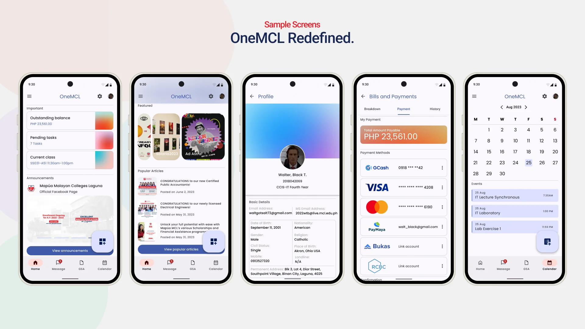
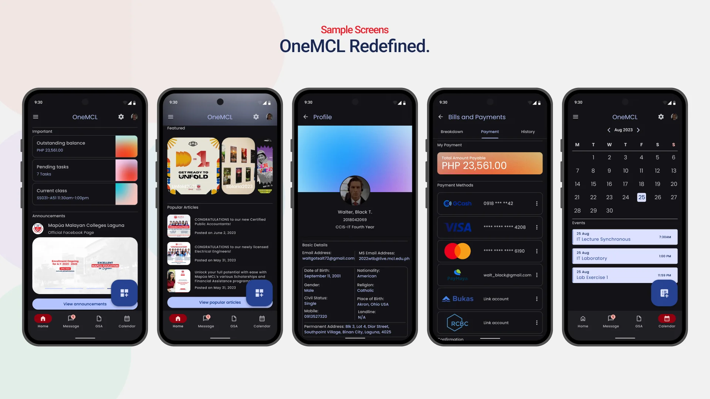

## The Brief

### Redesign the portal every student complains about.

OneMCL Redefined is our final project for CS110P: a Figma redesign of OneMCL, the student portal of Mapúa Malayan Colleges Laguna, reimagined as a mobile app. Six of us, all first years, none of us designers, took the existing portal through the five stages of the design thinking process, empathize, define, ideate, prototype, and test, and delivered a clickable prototype in light and dark themes.

## Context

### Eight lenient weeks for people who had never opened Figma.

The course introduced human-computer interaction and UI/UX principles, and the final project was where they all landed at once. The pace was forgiving, about eight weeks from start to finish, because the course knew what it was working with: students who had never touched a design tool. That slack is what made it work. There was room to learn Figma components properly, to redo screens after understanding auto layout, and to discover why a design system matters by feeling the pain of not having one first.

## Solution

### One home screen for everything the portal buries.

The redesign concentrates what students actually check into a single home screen: outstanding balance, pending tasks, the class currently in session, and announcements pulled from the school's official Facebook page, since that is where news genuinely breaks. Deeper in, Bills and Payments gets a full flow with linked payment methods, GCash, PayMaya, Visa, Mastercard, Bukas, and RCBC, a calendar collects class events and deadlines, and a profile page holds student records.

Every screen exists twice, light and dark, built from shared components so a change in one place propagated everywhere. Learning that lesson inside Figma, rather than being told it, is most of what I took from the course.

## The Outcome

### A prototype, and a direction.

The deliverable was a presented prototype, not a shipped app; OneMCL itself remained untouched. What shipped was the direction it set for me. This was the project where layout design, an interest I already had, lined up with what an IT student could actually do, and it introduced me to the field I moved into next: web development. The first thing I built there was the personal website that eventually became this one.
