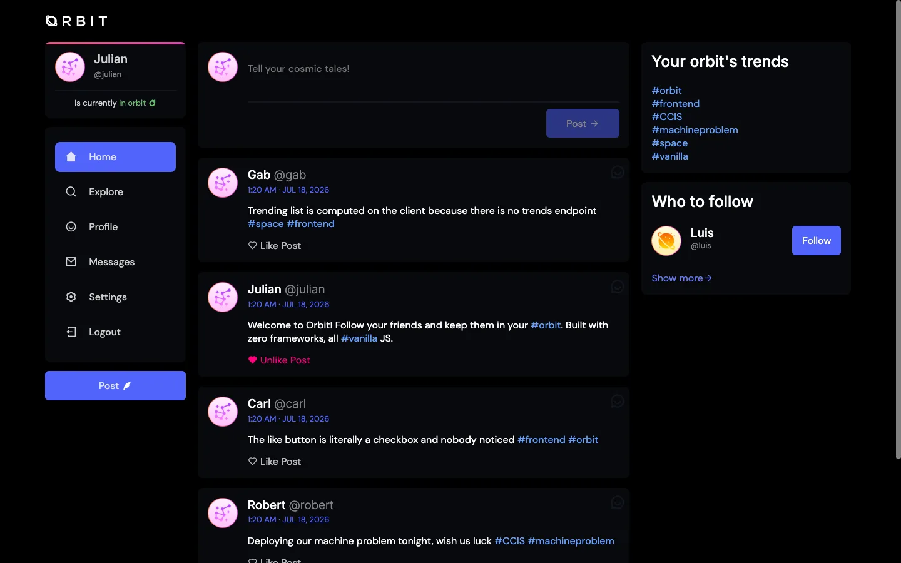
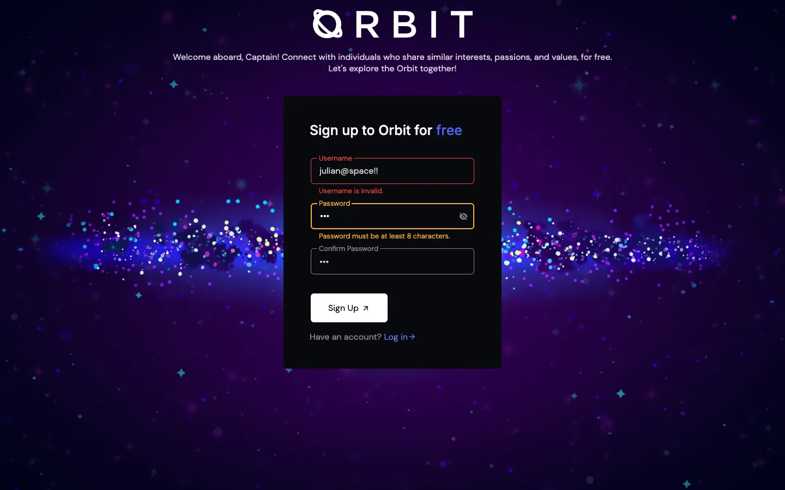
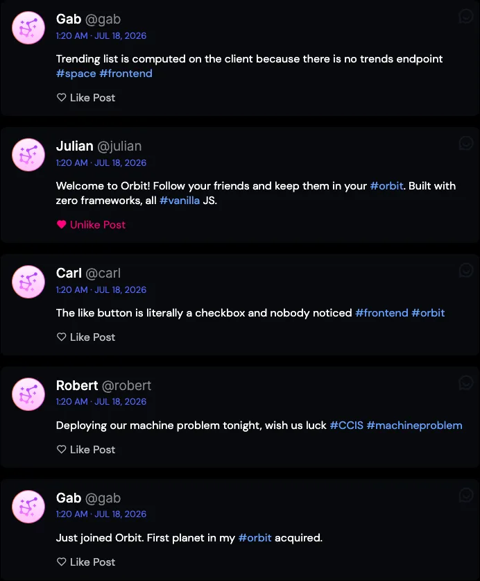
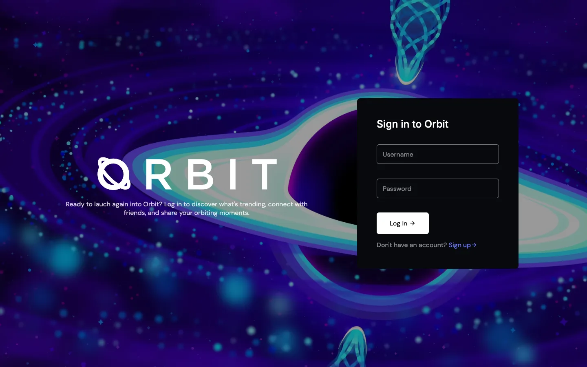
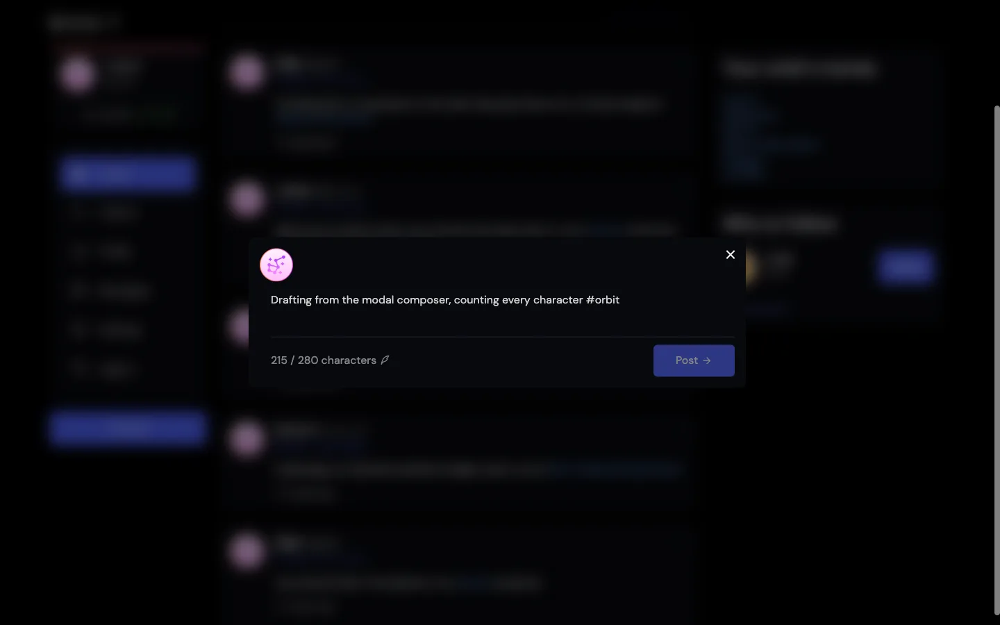
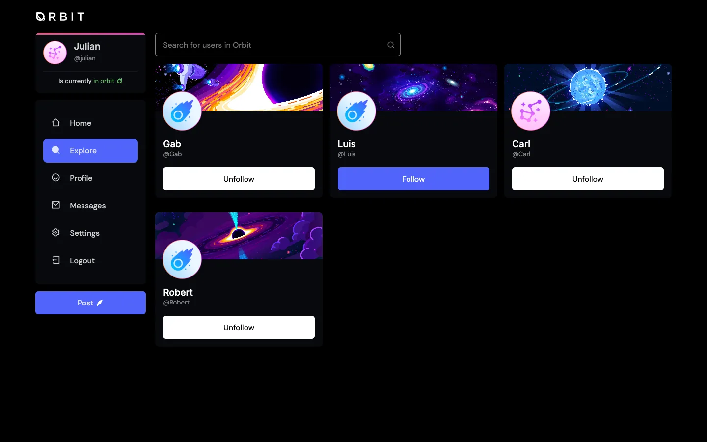
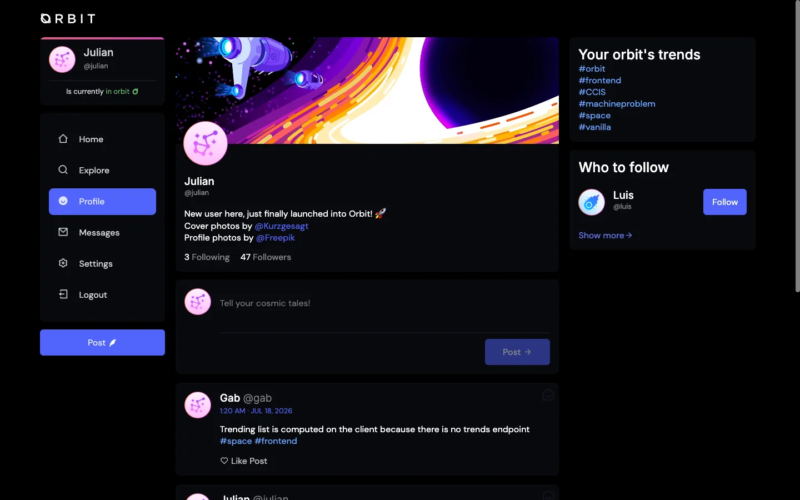

## The Brief

### A Twitter clone with a rule: touch nothing on the server.

Orbit is a social platform built for a machine problem in pure HTML, CSS, and JavaScript. The class forked a barebones Express API from our professor, and the fork came with one instruction in the README: do not modify the `TwitterCloneApi` folder. Everything visible, the design, the auth flow, the feed, the validations, had to be built on top of endpoints we could not change. I was the lead developer of a team of five.

## Context

### The backend was given. The concept was not.

The machine problem tested frontend fundamentals and RESTful API consumption, and left the rest open. We were free to design any concept over the same fixed endpoints, so I pitched the one that stuck: instead of following people, you orbit them, like planets held in each other's social gravity. The space theme drove the whole design system, a near-black interface with an orange-to-magenta gradient, defined as CSS custom properties in one file so five people could build pages without diverging.

This was also my first contact with npm and Node.js. Not through a framework, but through the plainest possible introduction: a `package.json`, a dependencies folder, and two servers running side by side in separate terminals.



## The Constraints

### No framework, no libraries, and an API we were not allowed to extend.

The rules removed every convenient answer. Form validation libraries like Zod exist, but we could not use them. Reactive state is what React is for, but no frameworks were allowed. And when a feature needed data the API did not serve, the usual move, adding an endpoint, was off the table. Anything the professor's routes did not provide had to be derived on the client from what they did provide.

## Solution

### Build the library-shaped things by hand.

I wrote the validation as a small engine instead of per-field `if` statements. Rules live in an array of objects, each one declaring which HTML attribute it reads, a predicate, and an error message generator. The engine loops over a form group, checks every attribute the input carries, and paints the field's error, shake animation, and helper text accordingly. Adding a rule means adding an object, not another branch:

```js
const validationOptions = [
  {
    attribute: "minlength",
    isValid: input => input.value && input.value.length >= parseInt(input.minLength, 10),
    errorMessage: (input, placeholder) => `${placeholder.textContent} must be at least ${input.minLength} characters.`
  },
  {
    attribute: "match",
    isValid: (input) => {
      const matchSelector = input.getAttribute("match");
      const matchedElement = formElement.querySelector(`#${matchSelector}`);
      return matchedElement && matchedElement.value.trim() === input.value.trim();
    },
    errorMessage: (input, placeholder) => { /* "Confirm Password should match Password" */ }
  },
  // maxlength, pattern, required...
];
```

It validates on blur for real-time feedback and again on submit, and the `match` rule handles password confirmation by pointing one input at another through a custom attribute. Five rules covered every form in the app.

The constraint on endpoints shaped features too. There is no trends endpoint, so trending hashtags are computed on the client: after fetching the feed, a regex pulls hashtags out of every post, counts them, and renders the top ten. The API serves posts; the frontend derives the trend.



## A Deeper Look

### The like button is a checkbox.

Every post needs a like button that toggles instantly, survives a page reload, and syncs with the server. That is reactive state, and the honest version of this story is that we did not know how to fake React, so we reached for the one element in HTML that already holds boolean state: a checkbox.

Each post card renders a hidden checkbox whose `id` is the post's ID. Checked means liked. The visual layer, heart icon fill, label text, a pop animation, just reacts to `change` events. One listener on the feed container catches every checkbox through event delegation and fires a `PATCH` to `/api/v1/posts/:id` with a `like` or `unlike` action. Persistence costs nothing extra: when the feed renders, each post's `likes` array from the API is checked against the logged-in user, and matching checkboxes start checked.

The same trick runs the follow buttons. During the demo, our professor asked if we had used React. We had used `<input type="checkbox">`.

Auth was the other first. The API issues a JWT on login; we stored it, attached it as a `Bearer` header on every request, and gated pages with a token check that redirects logged-out users to the login page and logged-in users past it. Writing that flow by hand, token in, header out, redirect on absence, taught me more about what session libraries do than any library would have.



## The Outcome

### "I can call you real software engineers."

Orbit shipped in ten days of commits, February 10 to 19, 2024, deployed on Netlify with the professor's Express API wrapped in a serverless function so the demo ran on a real URL instead of localhost. All of it, a five-rule validation engine, checkbox-driven reactive likes and follows, JWT auth flow, client-computed trends, a 280-character composer with a live counter, sits in about 1,000 lines of hand-written JavaScript with zero frontend dependencies.

After the presentation, our professor told us that having developed and presented this, he could call us real software engineers. It was also the first time I genuinely loved web development. Second year, first npm install, and the machine problem where I learned that the things frameworks give you are things you can build.

## Screens

### The rest of the orbit.

   
