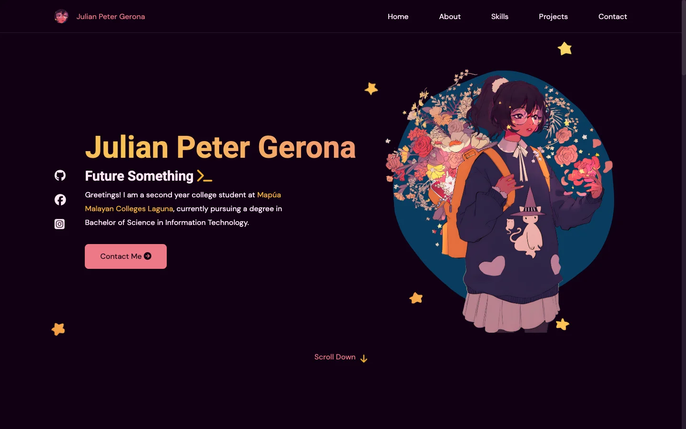
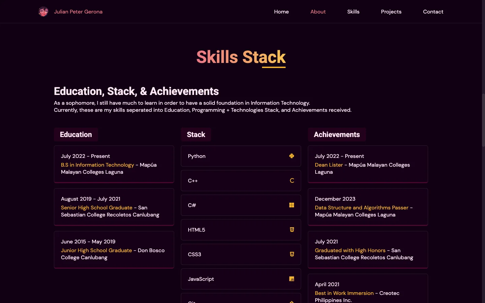
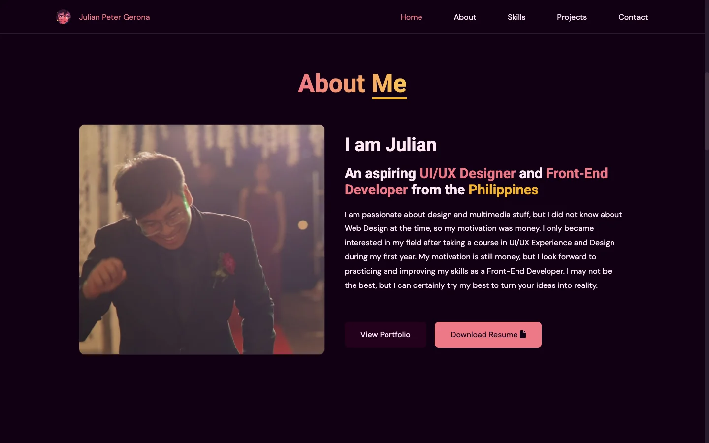
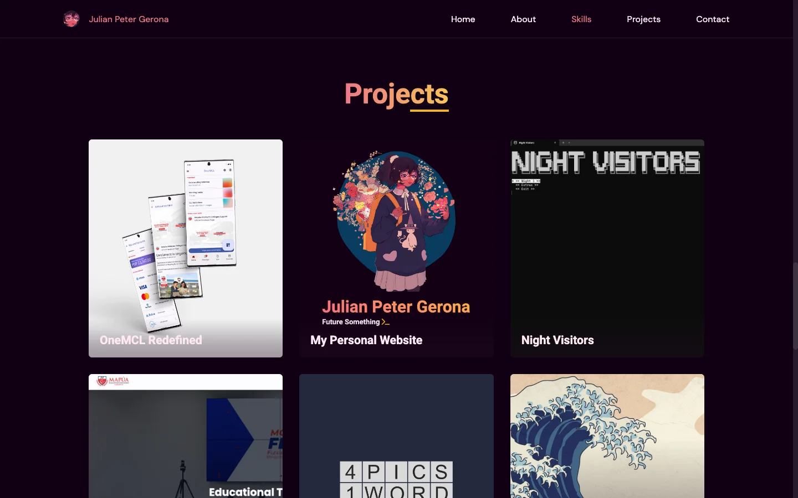
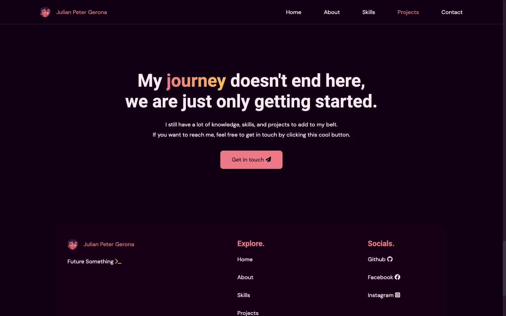

## The Brief

### The first thing I ever built for the web.

Portfolio v1 was the first learning task of our web development course: a personal website, built and deployed. It was also the first web development task I was ever handed, and I gave myself a rule to go with it: build everything in HTML and CSS, and let JavaScript in only where CSS could not follow. The predecessor of the site you are reading this on.

## Context

### Design system before markup.

Before writing a line of HTML, I set up a palette and a small design system to stay consistent. The whole scheme comes from the character I use as a profile picture, an illustration by vacuumch: a near-black plum background, pink and gold pulled from the flowers into CSS custom properties, and a pink-to-gold gradient for every headline. I browsed Awwwards for direction and landed on minimalist layout with loud gradients. The hero title reads "Future Something >_", because at that point the something was genuinely undecided.

Flexbox carried the layout, with Flexbox Froggy to thank for making it click. Sections reveal on scroll, and the hero character floats over a field of stars.

## A Deeper Look

### Every line of JavaScript had to earn its place.

The finished site runs on 98 lines of script. Scroll tracking highlights the active nav link by comparing `window.scrollY` against each section's offset, the same listener drives the scroll-reveal effect, a few lines toggle the hamburger menu and the project modals, and Parallax.js moves the hero character and stars against the cursor. Everything else, the layout, the gradients, the hovers, the responsive breakpoints, is CSS.

The breakpoints were also the fight of the project. Some styles refused to cascade into my media queries, and I reached for `!important` as a last resort more than once. I only later understood that as a specificity lesson rather than a CSS bug, which is exactly the kind of thing a first project is for.

## The Outcome

### Deployed, then outgrown.

The site went from empty repository to deployed in 25 commits between January 8 and 24, 2024, served on GitHub Pages at this same domain. The About section it shipped with was honest to a fault: "I did not know about Web Design at the time, so my motivation was money." The interest turned out to be real, the motivation diversified, and the site did its job until the portfolio you are reading replaced it.

## Screens

### The rest of v1.

  
